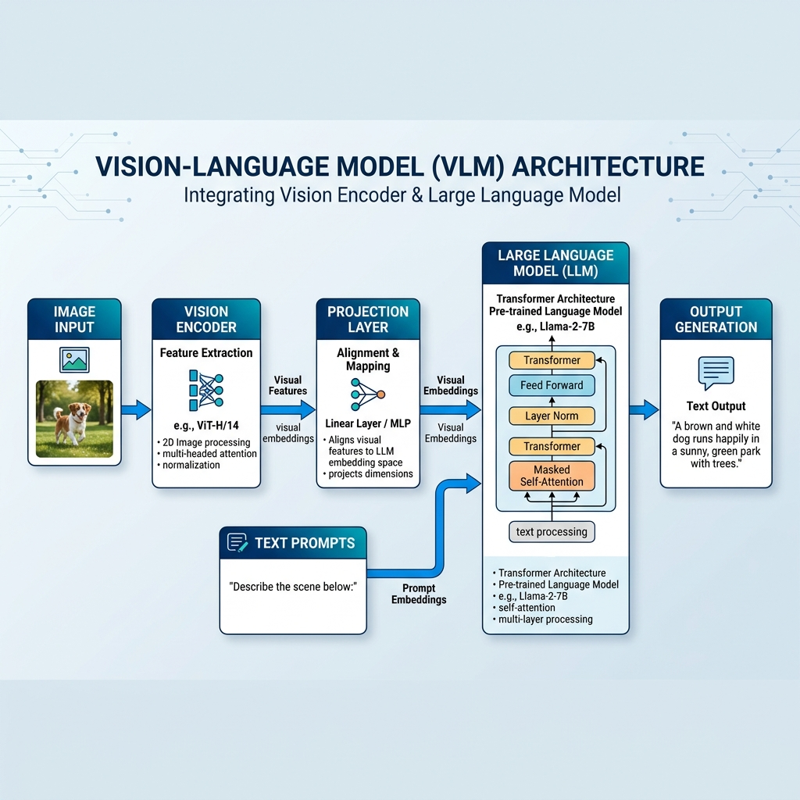
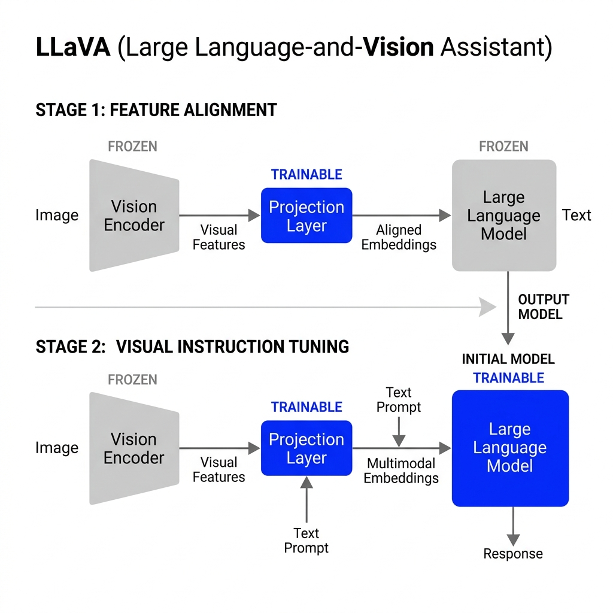
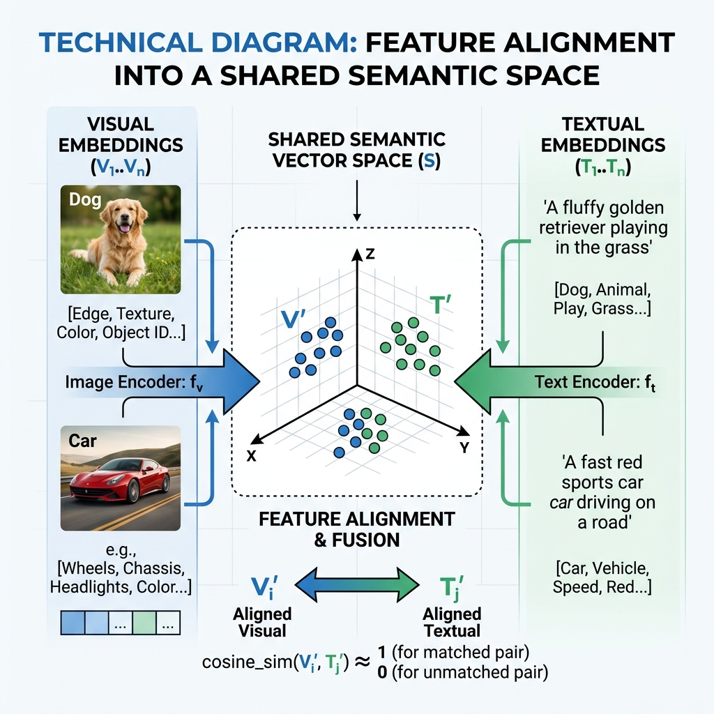

<h1>Assignment 4: Deep-Dive into LLaVA Vision-Language Architectures</h1>
<h3>NJIT CS-685: Computer Vision | Spring 2026</h3>

<b>Author:</b> Saketh Varma Dantuluri | <b>UCID:</b> sd2399

## 1. Architectural Analysis [Tasks 1.1 - 1.3]

The Large Language-and-Vision Assistant (LLaVA) represents an architectural milestone in multimodal AI. Rather than training a completely new modality-aware model from the ground up—an prohibitively expensive and data-intensive endeavor—LLaVA employs an "agentic" approach. It bridges a frozen, high-performance vision encoder with a powerful large language model (LLM), using a learned projection interface to achieve a shared semantic understanding.

 
<em>Figure 1: High-level architectural flow of the LLaVA framework, demonstrating the integration of CLIP and LLaMA.</em>

### 1.1 The Multimodal Forward Pass Mechanics
The technical core of LLaVA lies in its ability to treat visual features as "pseudo-text" tokens that can be ingested by a standard transformer-based language model.

**Detailed Component Breakdown:**
1. **Vision Encoder (CLIP ViT-L/14):** The process begins with an input image $X_v$. This image is partitioned into patches and processed through a pre-trained **CLIP (ViT-L/14)** vision transformer. This encoder extracts $Z_v$, a set of grid-level visual features. Specifically, it uses the penultimate layer's output to retain a balance between high-level semantics and spatial structural information that might be lost in the very last layer.
2. **Trainable Projection Matrix ($W$):** The visual features $Z_v$ reside in the CLIP latent space, which is not natively compatible with the LLM's word embedding space. LLaVA introduces a projection layer (originally a simple linear matrix, now often a 2-layer MLP in LLaVA-1.5) that transforms $Z_v$ into $H_v$, where $H_v = W \cdot Z_v$. These projected tokens have the same dimensionality as the LLM's word embeddings.
3. **Multimodal Input Concatenation:** The language model receives a unified sequence. Let $H_q$ be the embeddings for the user's text prompt. The full input given to the LLM is the concatenated sequence $\{H_v, H_q\}$. The LLM essentially "sees" the image as a series of prefix tokens followed by the text instruction.
4. **Autoregressive Generation:** The system then performs standard autoregressive decoding. Based on the fused visual and textual context, it predicts the next token in the sequence until a termination token is reached, allowing for complex, multi-turn dialogue grounded in the provided image.

**Technical Intuition on "Visual Tokens":**
This transformation is more than a simple resize; it is a manifold realignment. By projecting the visual features into the language space, the model allows the LLM’s pre-trained reasoning capabilities—honed on trillions of words—to be applied directly to visual concepts. The LLM processes the visual tokens using its standard self-attention mechanisms, allowing it to attend to specific parts of the "visual word" sequence when generating relevant text.

### 1.2 The Logic of Minimalist Projection
- **Semantic Continuity:** The efficacy of a simple projection layer relies on the "semantic alignment" hypothesis. Since CLIP was pre-trained on millions of image-text pairs, its visual latent space is already conceptually mapped to human language. A linear projection is sufficient because it only needs to rotate and scale these already-rich concepts into the LLM's specific coordinate system.
- **Latent Space Continuity Assumption:** This approach assumes that the underlying concepts (e.g., the concept of a "chair") are structurally similar across different high-dimensional models. It presumes that a linear mapping can bridge the gap between "what a vision model sees as a chair" and "what a language model knows as a chair."
- **Performance Bottlenecks:** If this alignment is insufficient, the model may suffer from "modality competition," where the LLM ignores visual cues in favor of its own strong language priors, leading to hallucinations that are linguistically plausible but visually incorrect.

### 1.3 Strategic Integration vs. Native Training
The decision to use a minimal projection layer over a full end-to-end retraining of all weights yields a distinct set of trade-offs:
- **Preservation of LLM Intelligence (Pros):** By keeping the LLM weights frozen during initial alignment, we ensure the model does not lose its advanced reasoning, coding, and mathematical abilities. It gains vision as a "new sense" without losing its existing "brain."
- **Computational Parity:** Training only the projection layer (Stage 1) requires significantly fewer GPU hours than training a native multimodal model, making it feasible for researchers to build upon state-of-the-art open models like LLaMA quickly.
- **Resolution and Granularity (Cons):** Because the vision backbone is frozen, the model is limited by the original training resolution of CLIP (often 224x224 or 336x336). This makes it struggle with extremely detailed tasks like reading small text in a large document or identifying microscopic features that weren't the focus of the original CLIP training objective.

---

---

## 2. Quantitative Training Pipeline [Tasks 2.1 - 2.2]

The intelligence of LLaVA is not just an architectural artifact; it is a pedagogical achievement. The model is taught to bridge the gap between pixels and prose using a rigorous two-stage training regime.

 
<em>Figure 2: The progressive transition from freezing to fine-tuning across the pipeline stages.</em>

### 2.1 The Two-Stage Training Paradigm
To maintain the stability of the large language model while essentially giving it a "new sense," LLaVA researchers developed a gated training approach.

| Training Stage | Technical Objective | Trained Components | Data Type / Dataset |
| :--- | :--- | :--- | :--- |
| **Stage 1: Feature Alignment** | Synchronize CLIP visual tokens with LLM embedding space. | **Projection Layer Only** | 595K Image-Caption Pairs (CC3M) |
| **Stage 2: Visual Instruction Tuning** | Align the model to human conversational intent and logic. | **LLM + Projection Layer** | 158K GPT-4 Generated Dialogs (LLaVA-Instruct) |

**Stage 1: Feature Alignment (Pre-training)**
In this foundational stage, both the CLIP vision encoder and the LLM weights are strictly frozen. Only the projection layer (the linear/MLP bridge) is updated. The model is presented with massive datasets of image-caption pairs (CC3M). 
- **The Philosophy:** The objective is not to teach the model how to reason, but to teach the projection layer how to translate visual features into a coordinate system the LLM already understands.
- **The Result:** After this stage, inputting an image of a "sunset" produces visual tokens that "feel" fundamentally like the word "sunset" to the LLM.

 
<em>Figure 3: Conceptual alignment of visual and textual manifolds into a shared latent space.</em>

**Stage 2: Visual Instruction Tuning (Fine-tuning)**
Once the bridge is stable, the projection layer and the LLM's full weights are unfrozen and fine-tuned together on high-quality multimodal instruction data.
- **The Philosophy:** The model is no longer just "captioning"; it is following complex directions (e.g., "Analyze the facial expression of the person on the left").
- **Why Stages Matter:** If Stage 1 were skipped, the chaotic, unaligned visual features introduced during instruction tuning would likely cause "catastrophic interference," degrading the LLM's linguistic capabilities before it could even begin to process the visual signal.

### 2.2 Synthetic Data & The GPT-4 Bridge
The success of LLaVA-1.5 is largely attributed to its innovative use of synthetic data generated by language-only GPT-4 models.

- **The Data Bottleneck:** High-quality, multi-turn multimodal dialogues are incredibly expensive to annotate manually. 
- **The Solution:** Researchers fed GPT-4 detailed textual representations of images (standard captions and localized bounding box coordinates). They then prompted GPT-4 to "hallucinate" complex, multi-turn conversations about these objects.
- **The Trade-off:** While this allows for massive scaling of conversational data, it creates a dependency on the synthetic generator's logic. LLaVA inherits GPT-4’s specific tone (helpful, verbose, polite) but also its risks of over-confidence. If the text description fed to GPT-4 was slightly incorrect, the training data for LLaVA becomes permanently "poisoned" with that hallucination.

---

## 3. Comparative Reflection & Synthesis [Tasks 3.1 - 3.3]

The LLaVA project marks a pivotal moment in the transition from specialized vision models to unified multimodal agents. However, it also highlights the fundamental challenges of "bolting" together disparate sensory modules that were never designed for joint operation.

### 3.1 Taxonomy of Multimodality: Late-Fusion vs. Native-Fusion
**Is LLaVA a "True" Multimodal Model?**
From a formal architectural standpoint, LLaVA is classified as a **Language Model conditioned on visual embeddings**, rather than a natively multimodal transformer.
- **The Late-Fusion Strategy:** Architectures like LLaVA and MiniGPT-4 utilize "late-fusion," where visual information is injected as a sequence of prefix tokens. This is highly advantageous for leveraging the **emergent reasoning** and **zero-shot capabilities** of large language models like LLaMA without the catastrophic cost of end-to-end retraining.
- **Comparison to BLIP-2:** While BLIP-2 uses a complex **Q-Former** (Querying Transformer) to selectively extract visual features, LLaVA’s simpler linear/MLP projection is often touted as more efficient because it doesn't introduce a new architectural bottleneck.
- **Native Multimodality:** In contrast, models like **Fuyu** or **Gemini** represent "native" multimodality, where images are processed through the same embedding layers as text from the ground up. While LLaVA "reads" an image as a sequence of abstract foreign words, native models "experience" the image as part of their fundamental sensory input.

### 3.2 The Dual-Locus of Alignment
A common misconception is that "alignment" is a single event. In the LLaVA framework, alignment is a dual-process phenomenon requiring both structural and cognitive synchronization.
- **Structural Alignment (The Manifold Bridge):** This occurs during Stage 1. It is the process of ensuring that visual vectors (CLIP features) physically reside within the same high-dimensional manifold as the LLM's word embeddings. Without this, the LLM would interpret visual input as out-of-distribution noise.
- **Behavioral Alignment (Intent Synchronization):** This occurs during Stage 2 (Visual Instruction Tuning). Even if the model can "see" a cat, it must be taught how to **interact** with that cat based on human intent. It must learn to prioritize specific visual regions (e.g., "Look at the license plate") over global scene descriptions. High performance is only achieved when the structural bridge (projection layer) and the behavioral logic (fine-tuned LLM weights) work in concert.

### 3.3 The "Frozen Vision" Resolution Ceiling
Perhaps the most significant foundational limitation of the LLaVA architecture is its reliance on a **frozen vision backbone.** 
- **The Sampling Bottleneck:** Because the CLIP encoder is not updated, it operates at a fixed resolution (e.g., 224x336). Any visual nuances that CLIP's pre-training originally discarded as "unimportant noise"—such as tiny text, subtle geometric anomalies, or distant background objects—are irretrievably lost before the LLM even begins processing.
- **The Irsurmountable Gap:** No amount of language fine-tuning can bypass this "optical limit." LLaVA-1.5 attempted to alleviate this by moving to a 336x336 resolution and a 2-layer MLP, but the fundamental bottleneck remains: the model cannot "learn" new visual primitives. If CLIP doesn't perceive it, the LLM cannot reason about it. This distinguishes LLaVA from fully end-to-end systems that can learn to "sharpen" their visual attention on domain-specific textures during the fine-tuning phase.

---

## 4. References & Bibliography

- **Liu, H., Li, C., Wu, Q., & Lee, Y. J. (2023).** *Visual Instruction Tuning.* In Advances in Neural Information Processing Systems (NeurIPS).
- **Radford, A., et al. (2021).** *Learning Transferable Visual Models from Natural Language Supervision (CLIP).* arXiv preprint arXiv:2103.00020.
- **Touvron, H., et al. (2023).** *LLaMA: Open and Efficient Foundation Language Models.* arXiv preprint arXiv:2302.13971.
- **Zhu, D., et al. (2023).** *MiniGPT-4: Enhancing Vision-Language Understanding with Advanced Large Language Models.* arXiv preprint arXiv:2304.10592.
- **Dai, W., et al. (2023).** *InstructBLIP: Towards General-purpose Vision-Language Models with Instruction Tuning.* arXiv preprint arXiv:2305.06500.
